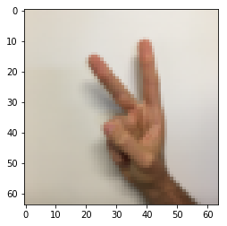
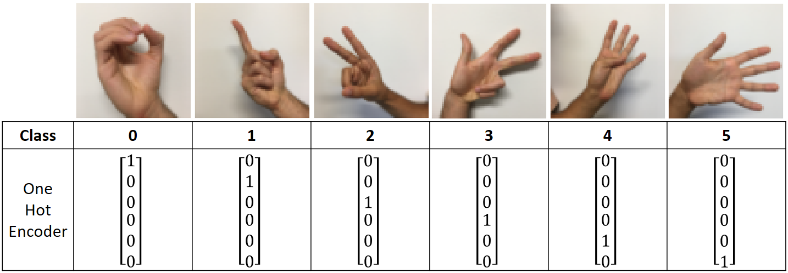
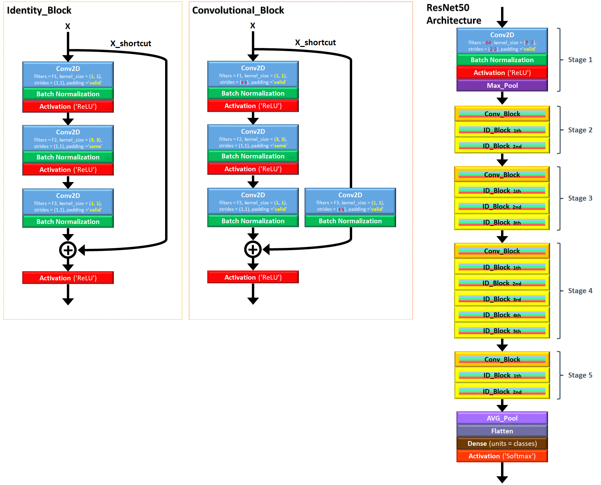
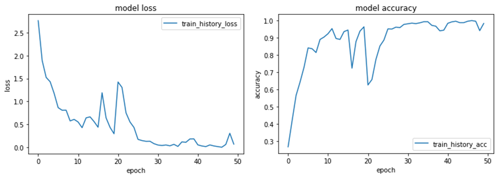

# Single-Hand-Sign_Image_Classification_with_ResNet50  
Image Classification of Single-Hand-Sign  
ResNet50_HandSign.py  
  
## Demon Image  
Randomly pick a number and demo the image & class. 
  
index = np.random.randint(len(Y_train_orig[0])) # pick a random integer from max/length number of train data  
print("index = " + str(index) + " ; " + "class = " + str(Y_train_orig[0,index]))  
plt.imshow(X_train_orig[index])  
  

index = 337 ; class = 2 
  
  
## Convert Class to One Hot Encoder  
  
  
  
## ResNet50  
Use Deep Neural Network model "ResNet50" to train the data.  
For ResNet50 coding, please see my previous repository.  
https://github.com/YETI-WU/Residual-Network  
  
  
  
#### Build model graph  
""" image shape 64 x 64 x 3 ; Single-Hand-Sign 6 classes """  
model = ResNet50(input_shape = (64, 64, 3), classes = 6)  
  
#### Compile model  
model.compile(optimizer='adam', loss='categorical_crossentropy', metrics=['accuracy'])  
  
#### Train model 
train_history = model.fit(X_train, Y_train, epochs = 50, batch_size = 32)  
print(train_history.history.keys())  
  
  
## Plot Loss and Accuracy 
  
#### Plot history of LOSS  
plt.plot(train_history.history['loss'])  
plt.title('model loss')  
plt.ylabel('loss')  
plt.xlabel('epoch')  
plt.legend(['train_history_loss'], loc='upper right')  
plt.show()  

#### Plot history of ACC
plt.plot(train_history.history['acc'])  
plt.title('model accuracy')  
plt.ylabel('accuracy')  
plt.xlabel('epoch')  
plt.legend(['train_history_acc'], loc='lower right')  
plt.show()  

  
  
## Test Model
scores = model.evaluate(X_test, Y_test)  
print ("Loss = " + str(scores[0]))  
print ("Test Accuracy = " + str(scores[1]))  
--------------------------------------------------  
120/120 [==============================] - 5s     
Loss = 0.265715452035  
Test Accuracy = 0.91666667064  
--------------------------------------------------  
  
## Model Save & Load
#### Save Model for Future Training  
model.save('ResidualNet50_HE.h5')  
  
#### Load Model from Previous Trained Model, and train again  
model = load_model('ResidualNet50.h5')  
model.fit(X_train, Y_train, epochs = 1, batch_size = 32)  
  
  
  
